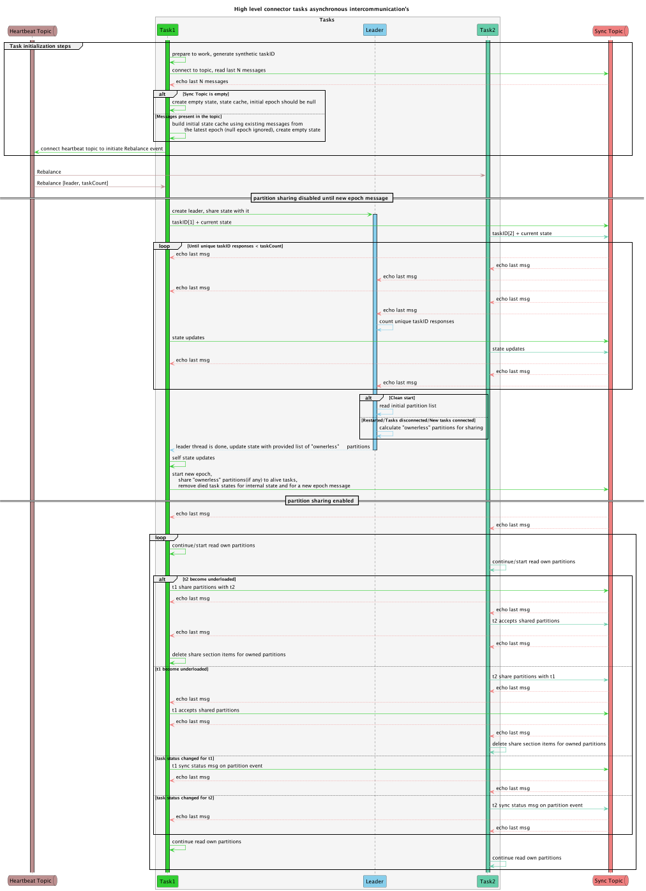

# Scalability

The unit of scalability will be the Task.

Each task should have a unique taskID (Kafka `group id/member id`).

## Synchronization

Leader task is required to coordinate job/share partitions between tasks.

We are going to reuse the `heartbeat` topic (`HBT`), used for the connector heartbeat messages.

## Idea

The idea is based on `Kafka Rebalance Protocol`.

Each task should subscribe as a consumer to `HBT`, using a consumer group named by spanner connector
name( `name` field in the connector configuration), it is unique enough by definition inside used
Kafka ecosystem instance.
When a consumer starts, it sends a first FindCoordinator request to obtain the Kafka broker
coordinator which is responsible for its group (group for `HBT` in our case). Then, it initiates the
rebalance protocol by sending a `JoinGroup` request.

The first consumer, within the group, receives the list of active members, and the selected
assignment strategy, and acts as the group leader while others receive an empty response.

The task which will receive the list of active members will become the leader.

### Sync topic

We are going to have a topic with the name `<connector_name>_connector_sync`(unique enough by
definition inside used Kafka ecosystem instance) to exchange status, and job coordination `ST`. Each
task should connect to `ST` in its own (important) consumer group to have the ability to read each
message.

We have two types of actors:

- `Leader` task [one], (task with Kafka `group id/member id`) which has become a leader
(has received the list of active consumers).

- `Regular` task, [many], which has received the empty list of active consumers.

## Flow



## Rebalance event handling

### Leader task

Reads the last few messages from the `ST`,  builds `SIM`, use `CIM`(cached state consolidated from
the `ST` messages and own task state), and creates a list of partitions which have to be reed by
tasks. Created list of partitions, should take into account state of the survived tasks, this means:
if task owns some set of partitions, they should not be moved to the other task. Then it
creates a new message with a new `epoch`, and `connectorState` array with initial state for each
`tasks`, list of active tasks. Information about lost tasks should be removed from `connectorState`.
Ownerless partitions, including not owned in `share` sections, have to be shared using partition
sharing protocol.
After it starts acting as a `Regular` task.
Next old-epoch messages have to be ignored by all tasks.

### Regular task

Immediately sends `incremental message` about it current state to `ST`. Continue to work.
Waits for new `epoch`, sends `incremental message` about it current state to `ST` with new epoch.

Each task should actively scan other tasks to find the most underloaded task to balance count of
owned partitions for each task. When task receives "onChild" partition event and the most
underloaded task is present - it should share child partition(s) to it.

### Partition sharing

Partition sharing is not allowed(disabled) right after `Rebalance` event until `New epoch` message
received by the particular task.

## Partitions

Each partition should be managed by its owner task. Owner task is a task started to read this
partition, in case owner task is died - partition is owned by leader.

### Partition sharing protocol

Each task `state` has section related to owned(processed) partitions, and section about partition(s)
it "wants" to share.
Shared partition should have target task information.

Each task should actively scan other tasks share section to pick up addressed partitions.
Picked partitions have to be reflected in own partition section, message with updated
`connectorState` has to be sent.

When task find that shared partition is picked up, it should respond with with updated
`connectorState`.

If partition is (still) not picked up - the task should not re-own it. Case "partition is not owned"
means something wrong with task, and if it is died - we will have "Rebalancing event" and ownerless
partitions (even partition is in `share` section) will be handled by `leader`.

## Incremental message structure

Main idea of the "Incremental message structure" is that each task is allowed to change/create only
its own state in the `connectorState`. Other states should remain unchanged.
The leader only is allowed to remove states for died tasks.

### Message

``` json
{
  "syncEpoch" : "uuid", // id of the current synchronization epoch
  "taskID": "taskID", // [required] unique id of the connector task, could change on connector/task restart, debug
  "messageTimestamp": "timestamp", // [required] time when message was generated
  // [required] array of states = state of current task + states of other tasks (assembled from previous messages based on latest state timestamp)
  "connectorState": [
    // ...
  ]
}
```

### State

``` json
{
  "taskID": "tasID-1", // [required] same as taskID of the message
  "stateTimestamp": "timestamp", // [required] time when state was generated
  "data": {} // [optional], should contain information about owned partitions
  "share": {} // [optional] shared partitions
}

```

## Task state change

When task state changed it should respond with `IM`, reflecting changes to `ST` immediately.

State changes:

- rebalancing event
- new epoch detected
- partition owned
- partition shared
- detected shared partition become owned
- partition finished
- partition removed

### Notes

#### Subscription order

On the start, the task should connect to `IM`, read a enough previous messages
to build `CIM`. then it should connect to `HBT` to issue rebalancing event and let other tasks to
know about new actor.
New task have to be completely prepared to read partitions immediately before connecting to `HBT`.

#### Partition removal

Owner of the partition should remove partition when it becomes redundant only when all other
referencing partitions become finished.
